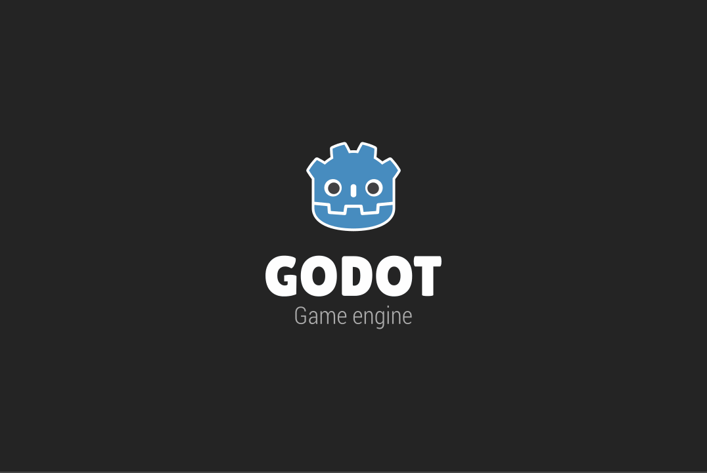

# Zicken
Inspired by the classic "Moorhuhn".

My entry for the "[STOP WAITING FOR GODOT](https://itch.io/jam/stop-waiting-for-godot)" game jam, organised by Terry Cavanagh.

#stopwaitingforgodot

## Controls
* Shoot with left-click
* Reload with right-click

Entry page: https://structed.itch.io/zicken

# Credits

* Bird Character: https://opengameart.org/content/bevouliin-green-flappy-bird-sprite-sheets
* SFX: https://kronbits.itch.io/freesfx
* Font: 8bit Wonder: https://fontlibrary.org/en/font/8bit-wonder
