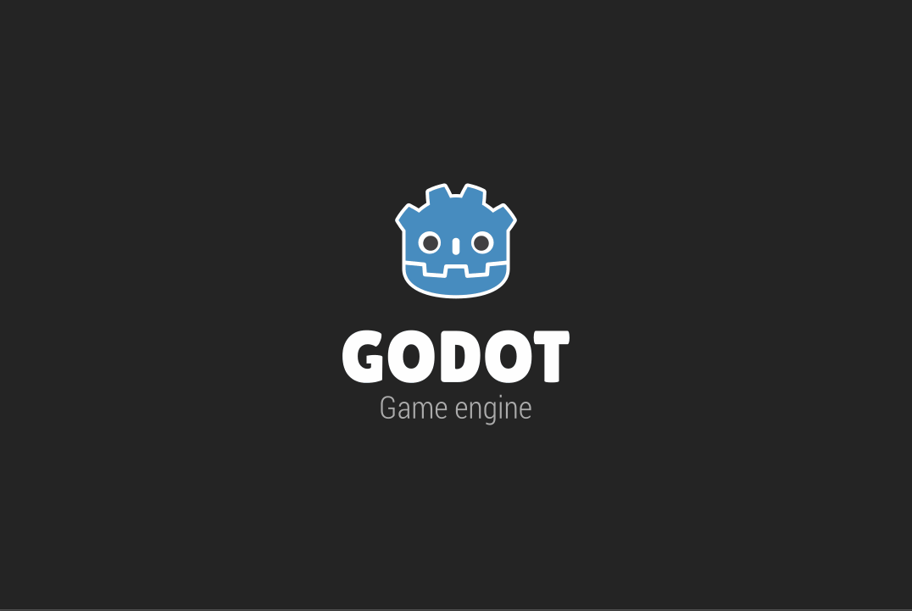

# Zicken
My entry for the "[STOP WAITING FOR GODOT](https://itch.io/jam/stop-waiting-for-godot)" game jam, organised by Terry Cavanagh.

#stopwaitingforgodot

This game is supposed to be a re-imagination of the classic "Moorhuhn".

## Controls
* Shoot with left-click
* Reload with right-click

Entry page: https://structed.itch.io/zicken

# Credits

* Bird Character: https://opengameart.org/content/bevouliin-green-flappy-bird-sprite-sheets
* SFX: https://kronbits.itch.io/freesfx
* Shotgun Shell original: https://sketchfab.com/3d-models/12-shotgun-shell-bbd6530ba44f4881b6128e9690f62832
* Font: 8bit Wonder: https://fontlibrary.org/en/font/8bit-wonder